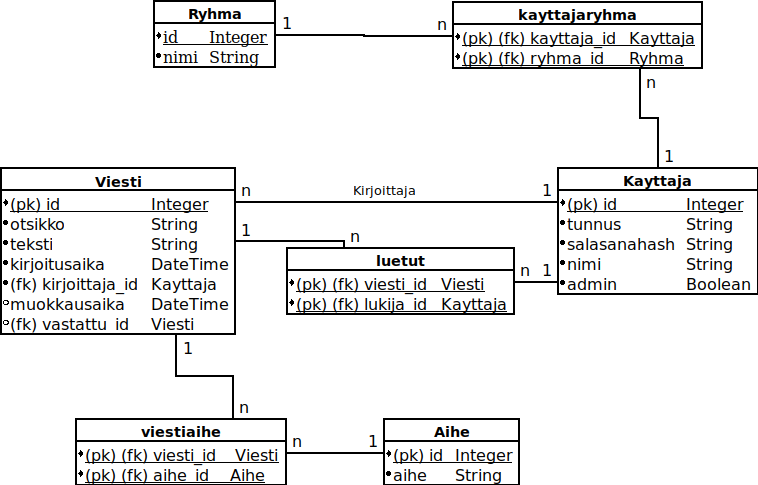

# Tietokannan rakenne

## Tietokantakaavio



## Varsinaiset taulut

### Kayttaja

#### Kuvaus

Sovellukseen rekisteröityneen käyttäjän tiedot.

#### CREATE TABLE -lause

```sql
CREATE TABLE kayttaja (
        id INTEGER NOT NULL,
        nimi VARCHAR(100) NOT NULL,
        tunnus VARCHAR(40) NOT NULL,
        "salasanaHash" VARCHAR(200) NOT NULL,
        admin BOOLEAN NOT NULL,
        PRIMARY KEY (id),
        UNIQUE (tunnus),
        CHECK (admin IN (0, 1))
)
```

### Aihe

#### Kuvaus

Viesteihin liitettävät aihetunnisteet.

#### CREATE TABLE -lause

```sql
CREATE TABLE aihe (
        id INTEGER NOT NULL,
        aihe VARCHAR(100) NOT NULL,
        PRIMARY KEY (id)
)
```

### Ryhma

#### Kuvaus

Sovelluksen rekisteröityneistä käyttäjistä koostuvan ryhmän tiedot.

#### CREATE TABLE -lause

```sql
CREATE TABLE ryhma (
        id INTEGER NOT NULL,
        nimi VARCHAR(100) NOT NULL,
        PRIMARY KEY (id)
)
```

### Viesti

#### Kuvaus

Foorumille kirjoitetun viestin tiedot.

#### CREATE TABLE -lause

```sql
CREATE TABLE viesti (
        id INTEGER NOT NULL,
        kirjoitusaika DATETIME NOT NULL,
        muokkausaika DATETIME,
        otsikko VARCHAR(100) NOT NULL,
        teksti VARCHAR(1000) NOT NULL,
        kirjoittaja_id INTEGER NOT NULL,
        vastattu_id INTEGER,
        PRIMARY KEY (id),
        FOREIGN KEY(kirjoittaja_id) REFERENCES kayttaja (id),
        FOREIGN KEY(vastattu_id) REFERENCES viesti (id)
)
```

## Liitostaulut

### kayttajaryhma

#### Kuvaus

Kuvaa käyttäjien kuulumista ryhmiin.

#### CREATE TABLE -lause

```sql
CREATE TABLE kayttajaryhma (
        kayttaja_id INTEGER NOT NULL,
        ryhma_id INTEGER NOT NULL,
        PRIMARY KEY (kayttaja_id, ryhma_id),
        FOREIGN KEY(kayttaja_id) REFERENCES kayttaja (id),
        FOREIGN KEY(ryhma_id) REFERENCES ryhma (id)
)
```

### luetut

#### Kuvaus

Viestin lukeneet käyttäjät (käyttäjän lukemat viestit).

#### CREATE TABLE -lause

```sql
CREATE TABLE luetut (
        viesti_id INTEGER NOT NULL,
        lukija_id INTEGER NOT NULL,
        PRIMARY KEY (viesti_id, lukija_id),
        FOREIGN KEY(viesti_id) REFERENCES viesti (id),
        FOREIGN KEY(lukija_id) REFERENCES kayttaja (id)
)
```

### viestiaihe

#### Kuvaus

Viesteihin liitetyt aihetunnisteet.

#### CREATE TABLE -lause

```sql
CREATE TABLE viestiaihe (
        viesti_id INTEGER NOT NULL,
        aihe_id INTEGER NOT NULL,
        PRIMARY KEY (viesti_id, aihe_id),
        FOREIGN KEY(viesti_id) REFERENCES viesti (id),
        FOREIGN KEY(aihe_id) REFERENCES aihe (id)
)
```
